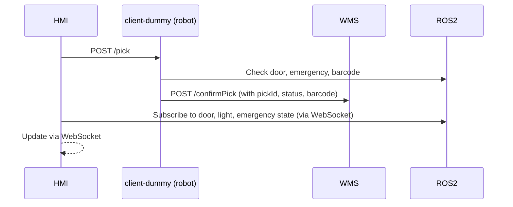

# Bin Picking Cell Control

Robotic picking system based on ROS 2 + Python microservices

## 🧩 Description

This package simulates a robotic bin-picking cell with ROS 2 nodes and multiple Python services (APIs and HMI). It replicates typical behaviors of a real-world industrial cell by handling picking requests, barcode scanning, safety checks (door, emergency button), and visual feedback.

The system is composed of:

- A set of **ROS 2 nodes** (simulating the hardware layer)
- A **dummy client** that acts as the robot, confirming picks
- A **WMS server** that receives confirmations
- A **real-time HMI**, built with Flask + SocketIO, to visualize system status and trigger picks

---

## 📦 Repository structure

```
.
├── client-dummy/           ← Simulated robot that processes pick requests
├── hmi/                    ← Real-time dashboard using Flask + SocketIO
├── ros2_picking/           ← ROS 2 nodes (scanner, door, emergency, stacklight)
├── wms-server/             ← Receives pick confirmation from robot
└── docker-compose.yml      ← Launches all services and nodes
```

---


### 📘 API Documentation via Swagger

Both the **WMS Server** and the **Client-Dummy** expose their API documentation using **Swagger UI**, which is automatically generated using Flask-RESTX.

- **WMS Server Swagger**: `http://localhost:8081/`
- **Client-Dummy Swagger**: `http://localhost:8080/`


## ⚙️ System Components

### ✅ ROS 2 Nodes (`ros2_picking/`)

- **scanner_node**: Publishes random barcodes and provides the latest scanned code.
- **door_handle_node**: Simulates a door sensor and allows toggling/opening/closing.
- **emergency_button_node**: Simulates an emergency button that blocks operations.
- **stack_light_node**: Subscribes to door and button, and publishes a visual state (green, yellow, red).

### ✅ HMI (`hmi/`)

- Built with **Flask + Flask-SocketIO** for real-time monitoring.
- **Initiates pick requests by sending them to `client-dummy`** (`POST /pick`).
- Displays:
  - Emergency button and door state
  - Stack light state (green/yellow/red)
  - Pick request and confirmation status
- Uses **WebSocket (SocketIO)** for automatic updates without page refresh.

### ✅ Dummy Client (`client-dummy/`)

- Receives the pick requests directly from the **HMI** on `/pick`.
- Simulates the robot logic:
  - Checks door and emergency button state via ROS2
  - Retrieves a barcode from the scanner node
  - Determines whether the pick is successful
- Sends a confirmation back to the **WMS Server** via `POST /confirmPick`.

### ✅ WMS Server (`wms-server/`)

- Exposes an endpoint `POST /confirmPick` to receive results from the client.
- Logs or processes the pick confirmations for further use.

---

## 🔁 System Flow


    participant HMI
    participant ClientDummy as client-dummy (robot)
    participant WMS

    HMI->>ClientDummy: POST /pick
    ClientDummy->>ROS2: Check door, emergency, barcode
    ClientDummy->>WMS: POST /confirmPick (with pickId, status, barcode)
    HMI-->>HMI: Update via WebSocket

---

## 🚀 Installation & Usage (via Docker)

> ⚠️ **This system is only supported via Docker Compose** — no manual ROS or Python setup required.

### 1. Clone the repository

```bash
git clone https://github.com/JTSoria1603/ros2_picking.git
cd ros2_picking
```

### 2. Launch all services

```bash
docker compose up --build
```

Docker will:
- Build each microservice and ROS node
- Install all dependencies (Flask, rclpy, SocketIO, etc.)
- Launch the full simulation automatically

### 3. Access the interfaces

| Service         | URL                     | Description                    |
|-----------------|-------------------------|--------------------------------|
| Client-Dummy    | `http://localhost:8080` | Receives pick requests         |
| WMS Server      | `http://localhost:8081` | Receives pick confirmations    |
| HMI Dashboard   | `http://localhost:8082` | Real-time UI with SocketIO     |

---

## 📡 Available ROS 2 Services

Each node exposes the following services:

### scanner_node
- `/get_barcode` (Trigger)

### door_handle_node
- `/toggle_door` (Trigger)
- `/get_door_state` (Trigger)

### emergency_button_node
- `/press_emergency_button` (Trigger)
- `/release_emergency_button` (Trigger)
- `/get_emergency_button_state` (Trigger)

### stack_light_node
- `/get_stack_light_state` (Trigger)

---

## 🛠 Requirements

- Docker + Docker Compose
- Compatible with Linux / WSL2 / macOS (Docker Desktop)

> No ROS 2 installation is required on the host system. Everything runs inside Docker containers.

---

## 🧾 Software Licenses

This project includes third-party open-source software:

| Dependency        | License                    | Requirements                              |
|-------------------|----------------------------|-------------------------------------------|
| ROS 2 / rclpy     | Apache 2.0 / BSD‑3‑Clause  | Must retain license and attribution notices |
| Flask             | BSD‑3‑Clause               | Include license text                      |
| Flask‑SocketIO    | MIT                        | Include license and notices               |
| Flask‑RESTX       | Apache 2.0                 | Include license and clauses               |

---

## 🙌 Credits

Developed by [JTSoria1603](https://github.com/JTSoria1603)

